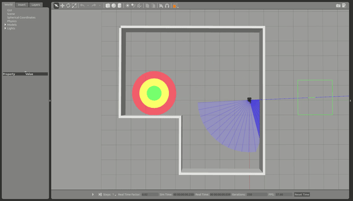
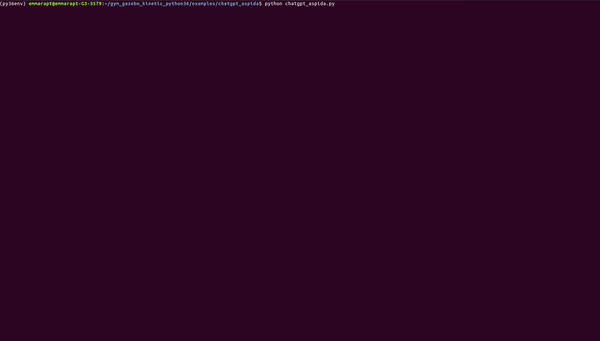

<div id="top"></div>

<!-- PROJECT LOGO -->
<br />

<div align="center">

<a href="">
    
  </a>

   <h3 align="center">An open-source, easy-to-use, and universally adaptable
robotic library suite for any robot.</h3>
  <a href="">
    
  </a>


  
  <p align="center">
    An AI-ROS-based framework for empowering mobile robots with human-level planning by text or voice commands bridging the gap between humans and robots by leveraging secure and precise instructions from ChatGPT for generating robotic-related code.
    <!-- <br />
    <a href="https://github.com/emmarapt/ASPiDA_ChatGPT"><strong>Explore the docs »</strong></a>
    <br /> -->
    <br />
    <a href="https://github.com/emmarapt/ASPiDA_ChatGPT/blob/main/gifs/project_gif.gif">View Demo</a>
    ·
    <a href="https://github.com/emmarapt/ASPiDA_ChatGPT/issues">Report Bug</a>
    ·
    <a href="https://github.com/emmarapt/ASPiDA_ChatGPT/issues">Request Feature</a>
  </p>
</div>


<!-- ############################################### -->
<!-- TABLE OF CONTENTS -->
<details>
  <summary>Table of Contents</summary>
  <ol>
    <li>
      <a href="#about-the-project">About The Project</a>
    </li>
    <li><a href="#prerequisites">Prerequisites</a></li>
     <li><a href="#installation">Installation</a></li>
    <li><a href="#how-to-run">How to run</a></li>
     <li><a href="#mobile-robot-navigation-using-deep-reinforcement-learning">Mobile robot navigation using deep reinforcement learning</a></li>
    <li><a href="#video-demos">Video Demos</a></li>
    <li><a href="#real-life-experiments">Real-life Experiments</a></li>
    <li><a href="#license">License</a></li>
    <li><a href="#contact">Contact</a></li>
    <li><a href="#acknowledgments">Acknowledgments</a></li>
    <li><a href="#cite-as">References</a></li>
  </ol>
</details>

<!-- ############################################### -->
<!-- ABOUT THE PROJECT -->
## About The Project
<div align="center">
  <a href="https://github.com/emmarapt/ASPiDA_ChatGPT/blob/main/images/Aspida_arch.png">
    
  </a>
</div>

This project aims to enhance the capabilities of mobile robots by equipping them with planning abilities akin to human-level thinking. This endeavor seeks to bridge the gap between humans and robots by leveraging secure and precise instructions from ChatGPT guided by natural language. Toward this direction, we introduce a high-level function library that unlocks the challenges of AI-generated code drift while employing Large Language Models (LLMs) for generating robotic-related code that may compromise the robot's structural integrity or the failure of the assigned task. This function library can be seamlessly integrated into any robotic platform through APIs, thereby allowing ChatGPT to comprehend user objectives expressed in natural language format and translate them into a logical sequence of high-level function calls.


<!-- ############################################### -->
<!-- Prerequisites-->
## Prerequisites

**Step 1. Install Ubuntu and ROS**

**Step 2: Setup catkin_ws for ROS with python 3.6**
> For ROS melodic & Kinetic you can refer to the following [guide](https://medium.com/@beta_b0t/how-to-setup-ros-with-python-3-44a69ca36674).

**Step 3. Clone the following repository:**
 ```sh
cd catkin_ws/src
git clone https://github.com/emmarapt/turtlebot3_home_service_challenge.git
   ```
> Note: To install additional packages, please refer to the following [e-manual](https://emanual.robotis.com/docs/en/platform/turtlebot3/overview/).
>
##### Build catkin with Python3.6
```
cd ~/catkin_ws
source py36env/bin/activate
export PYTHONPATH=$PYTHONPATH:/usr/local/lib/python3.6/dist-packages 
catkin build --cmake-args -DCMAKE_BUILD_TYPE=Release -DPYTHON_EXECUTABLE=/your/path/catkin_ws/py36env/bin/python3.6 -DPYTHON_LIBRARY=/usr/lib/python3.6/config-3.6m-x86_64-linux-gnu/libpython3.6m.so -DPYTHON_INCLUDE_DIR=/usr/include/python3.6m
```


<!-- ############################################### -->
## Installation:

**Step 1. Clone the repo**
   ```sh
   git clone https://github.com/emmarapt/ASPiDA_ChatGPT.git
   ```

**Step 2. Install the required system packages:**
   ```sh
   pip install -r requirements.txt
   ```
> Note: TensorFlow version for CPU & GPU support may differ based on your system requirements.

#### ChatGPT for Python 3.6:

To install openai==0.27.2 do the following steps:

```
git clone https://github.com/openai/openai-python.git
```
Build from source:
```
cd openai-python
python setup.py install
```

An error will occur:
> from contextlib import asynccontextmanager
> 
> ImportError: cannot import name 'asynccontextmanager'

Navigate to "/your/path//openai-python/openai/api_requestor.py" and change:
> from contextlib import asynccontextmanager

to

> from async_generator import asynccontextmanager 

Uninstall openai if any and run:
```
python setup.py install
```

**Step 3. Simulate keyboard events**

Open a terminal, go to Terminal->Preferences, and enable mnemonics.

## How to run:

1. Navigate to the project directory via a terminal and run:
    ```sh
   python ChatBot.py or VoiceBot.py
   ```
   
2. Do not interrupt until initialization.

3. Text or speak.

   
  Enjoy!


<p align="right">(<a href="#top">back to top</a>)</p>


<!-- ############################################### -->
## Mobile robot navigation using deep reinforcement learning

This repository also contains an OpenAI reinforcement learning setup for the Turtlebot3 in **Python 3.6**  allowing the use of  [Spinning Up](https://spinningup.openai.com/en/latest/) / [Stable Baselines](https://stable-baselines3.readthedocs.io/en/master/) / [Baselines](https://github.com/openai/baselines) deep reinforcement learning algorithms in the robot navigation training.


1. Install an OpenAI gym extension for using Gazebo known as [gym-gazebo](https://github.com/erlerobot/gym-gazebo) [**Optional**]
2. Install at least one: [OpenAI Spinning Up](https://spinningup.openai.com/en/latest/user/introduction.html), [Stable Baselines](https://stable-baselines3.readthedocs.io/en/master/), [Baselines](https://github.com/openai/baselines) in python3.6 virtual env


There are two ways of starting training and evaluation:

1. **If gym-gazebo installed:** Use ```Gazebo gazebo_env.GazeboEnv``` in env.py and run ```python robot_main_####.py ```. This will automatically launch the robot configurations in gazebo and start training/evaluation. 
   > Note: Add ```gazebo_env.GazeboEnv.__init__(self, "competition.launch")``` in env.py
2. Use ```gym.Env``` in env.py,

```
cd ~/catkin_ws
source /opt/ros/$ROS_DISTRO$/setup.bash 
source /catkin_ws/devel/setup.bash
roslaunch turtlebot3_home_service_challenge_simulation competition.launch
```

2. Run ```python robot_main.py ``` to start training/evaluation

<div align="center">
  <a href="https://github.com/emmarapt/ASPiDA_ChatGPT/blob/main/gifs/rl_gif.gif">
    
  </a>
</div>

3. Go to aspida_wrapper.py and specify your trained policy.

<p align="right">(<a href="#top">back to top</a>)</p>


<!-- Demos-->
## Video Demos:
Now that you have the ASPiDA ChatGPT running, you can use it to empower mobile robots using text or voice commands. 
Here is a video demonstration of how ChatGPT initializes this project using ROS, Gazebo, and Rviz.  


<div align="center">
  <a href="https://github.com/emmarapt/ASPiDA_ChatGPT/blob/main/gifs/project_gif.gif">
    
  </a>
</div>  

In the following videos,  we explore the groundbreaking fusion of cutting-edge technology and robotics - ChatGPT using both the ChatBot and the VoiceBot. ChatGPT seamlessly translates natural language through voice commands into robotics objectives, empowering an assistive robot designed to aid the elderly in a realistic virtual environment.


 <div align="center">
  <!--<a href="https://youtu.be/RrMleHW5YRw"></a>-->
  <!--<a href="https://youtu.be/z3siFzY07w8"></a>-->
  <a href="https://youtu.be/RrMleHW5YRw"></a>
  <a href="https://youtu.be/z3siFzY07w8"></a>
  </div>


<!-- ############################################### -->
<!-- Real Life Experiments -->
## Real-life Experiments
To validate the efficiency of ASPiDA ChatGPT we evaluate the custom robotic library utilizing the VoiceBot in a real-world scenario: From Picking to Placing an object. 

<div align="center">
  <a href="https://github.com/emmarapt/ASPiDA_ChatGPT/blob/main/images/real-life%20experiment.png">
    
  </a>
</div>

Watch the Turtlebot3 Waffle Pi with OpenManipulator-X Showcase Precision: From Picking to Placing using voice commands!

<div align="center">
  <a href="https://youtu.be/WgfPbgZK8ic"></a>
</div>

In this video, Turtlebot3 adeptly executes a precision-driven task—from picking to placing a bottle of watter in a specific target location. The intricacy of the operation becomes even more impressive as the entire process is orchestrated within an augmented reality (AR) environment, utilizing distinct AR markers for accurate positioning. Watch as the Turtlebot3 identifies, approaches, and seamlessly grasps the water bottle, perfectly centered within an AR markers

<!-- ############################################### -->
<!-- Qualitative Results -->
<!-- ## Qualitative Results
 To qualitatively analyze the robot's performance during pick and place tasks, trajectory plots of the gripper's joints were generated using the rqt tool. These plots offer a clear visualization of the robot's gripper joint movements and the accuracy of the executed trajectories. 

<div align="center">
  <a href="https://github.com/emmarapt/ASPiDA_ChatGPT/blob/main/images/Qualitative%20gripper%20results.png">
    
  </a>
</div> -->


<!-- ############################################### -->
<!-- LICENSE -->
## License

Distributed under the MIT License. See [LICENSE](https://github.com/emmarapt/ASPiDA_ChatGPT/blob/main/LICENSE) for more information.

<p align="right">(<a href="#top">back to top</a>)</p>


<!-- ############################################### -->
<!-- CONTACT -->
## Contact

Emmanuel K. Raptis - [github](https://github.com/emmarapt) - emmarapt@iti.gr

Athanasios Ch. Kapoutsis - [github](https://github.com/athakapo) - athakapo@iti.gr

<p align="right">(<a href="#top">back to top</a>)</p>


<!-- ############################################### -->
<!-- ACKNOWLEDGMENTS -->
## Acknowledgments
This research has been co-financed by the European Union and Greek national funds through the Operational Program Competitiveness, Entrepreneurship and Innovation, under the call RESEARCH-CREATE-INNOVATE (T2EDK-02743). 
<p align="right">(<a href="#top">back to top</a>)</p>


<!-- ############################################### -->
<!-- REFERENCES -->
## Cite As:

(Not published yet)

<!-- MARKDOWN LINKS & IMAGES -->
[product-screenshot]: https://github.com/emmarapt/ASPiDA_ChatGPT/blob/main/images/Aspida_arch.png